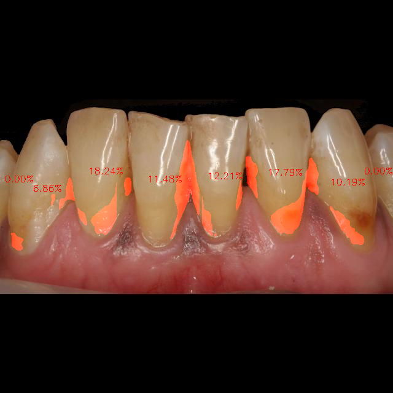
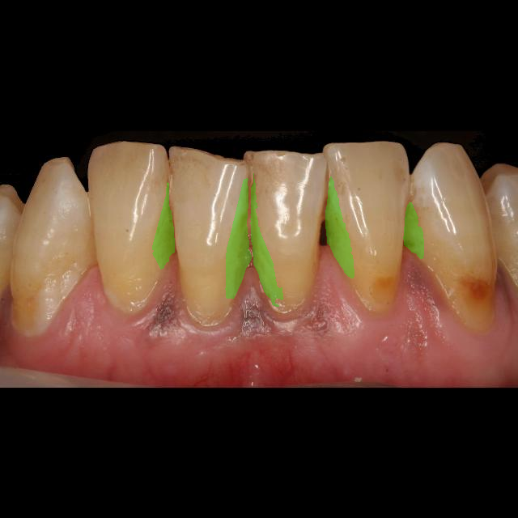

# 🦷 Dental Calculus Segmentation Pipeline

This project automates the detection and segmentation of dental calculus from intraoral images. It uses a two-stage deep learning pipeline:

- **Tooth detection** using a YOLOv8 model.
- **Calculus segmentation** using a U-Net model on each detected tooth.

---

## 📁 Directory Structure

```

Original annotated dataset in COCO format:

dataset/
├── train/
│ └── ...
├── valid/
│ └── ...
└── test/
├── _annotations.coco.json
└── IMG*.jpg # All dataset images in this category


Generated pipeline results:

output/
├── train/
│ └── ...
├── valid/
│ └── ...
└── test/
└── IMG_/ # Folder per image (named after original image)
├── data/ # Cropped tooth images
├── teeth_masks/ # Tooth segmentation masks from YOLO
└── calculus_masks/ # COCO-based masks for each tooth

```

## 🧠 Model Files

- `segmentyolo.pt`: YOLOv8 model weights for tooth detection.
- `best_model.pth`: Trained U-Net model for calculus segmentation.

---

## 🧾 Code Overview

| File                     | Purpose 
|--------------------------|-------------------------------------------------------------------------------|
| `main.py`                | Runs the full pipeline (YOLO + U-Net)                                         |
| `segment_teeth.py`       | Detects and crops individual teeth using YOLO                                 |
| `split_calculus_masks.py`| Aligns cropped teeth with COCO calculus masks                                 |
| `unet_overlay.py`        | Applies U-Net model and overlays predictions                                  |
| `plotting_examples.py`   | Visualization tools for predictions vs ground truth                           |
| `tooth_seg.ipynb`        | Jupyter notebook for training and testing unet model, generates model weights |
| `default.yaml`           | Configuration for model paths and settings                                    |
| `.gitignore`             | Git ignore file for weights, outputs, etc.                                    |


## 🧩 Function Reference

### `segment_teeth.py`

#### `YoloToothSegmenter.__init__(config_path)`
Initializes the tooth segmenter:
- Loads paths and weights from the `default.yaml` config.
- Loads the YOLOv8 model for segmentation.

#### `YoloToothSegmenter.run()`
Main function to process all input images:
- Runs YOLO to detect and segment teeth.
- Crops and saves each detected tooth image and its mask.
- Collects crop bounding boxes.
- Calls `create_calculus_masks` to match each crop with its corresponding COCO calculus annotation and generate aligned masks.

---

### `split_calculus_masks.py`

#### `create_calculus_masks(coco_path, image_name, crop_boxes, output_dir, indices=None)`
Generates binary calculus masks for each cropped tooth:
- Loads the COCO `.json` annotation file.
- For each bounding box:
  - Transforms polygon annotations to local coordinates relative to the crop.
  - Creates a binary mask of calculus inside the crop.
- Saves each mask as `calculus_mask_<index>.png` to `output_dir`.

---

### `unet_overlay.py`

#### `plot_unet_predictions()`
Runs the trained U-Net model on all detected teeth in a test image:
- Uses YOLO to extract bounding boxes of each tooth.
- Crops and resizes each tooth to 256×256.
- Runs the U-Net model and generates prediction masks.
- Overlays each prediction in red on the original image.
- Computes the percentage of calculus overlap per tooth.
- Annotates each tooth region with the percentage value.
- Saves the final visualization as `predicton.png`.



---

### `plotting_exmaples.py`

#### `plot_one_tooth_test()`
Visualizes a single cropped tooth:
- Loads a hardcoded image and mask from `output/`.
- Overlays the calculus mask in red.
- Saves and shows the overlay using `matplotlib`.

#### `plot_whole_image_with_mask()`
Creates a green overlay of the full COCO segmentation:
- Loads image and COCO annotations.
- Builds a combined mask and overlays it in green.
- Saves result as `real.png`.




## ⚙️ Configuration Details

The `default.yaml` file defines paths and parameters used throughout the pipeline. It allows centralized control over model weights and data directories.

### Structure:

```yaml
MODEL:
  WEIGHTS: "segmentyolo.pt"
UNET:
  WEIGHTS: "best_model.pth"
DATA:
  INPUT_DIR: "dataset/train"  #options: valid, test, train, test_samples
  OUTPUT_DIR: "output"
  COCO_PATH: "output/_annotations.coco.json"

```
